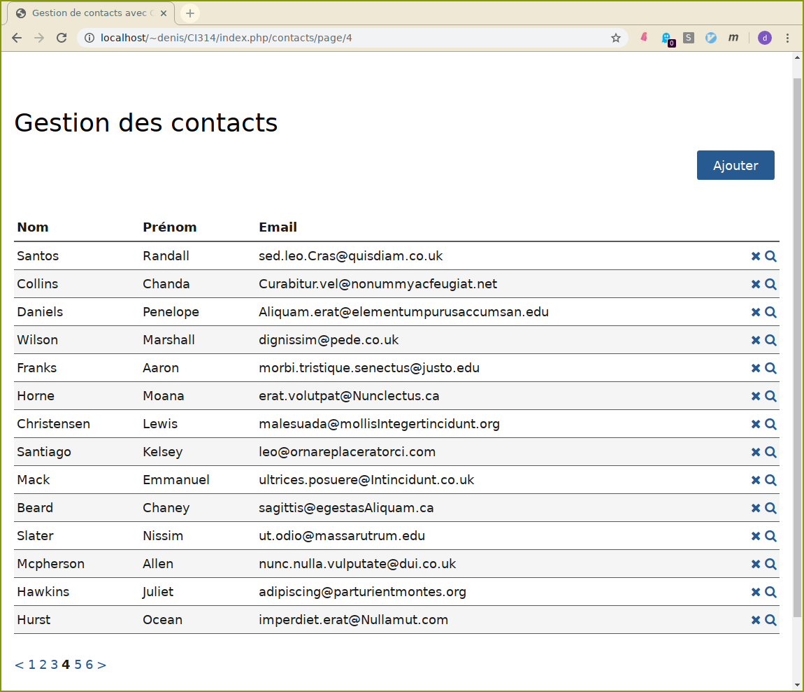

# Gestionnaire de contacts mail MVC avec CodeIgniter (v3).


Le but est reprende l'exemple vu en cours, en ajoutant quelques
fonctionnalités tout en respectant l'architecture de l'application.

La documentation de CodeIgniter est disponible à la racine dans le
repertoire `user_guide`.

L'application utilise une table
```
contacts** (#id,nom,prenom,email)
```	sur mysql. Le site (http://generatedata.com/)[http://generatedata.com/] 
permet de générer un jeu de données pour votre table.

Vous devez d'abord réglé les paramètres de configuration dans le
répertoire `application/config`.

-  **config.php** : donnez l'adresse de base de votre site
    (base\_url). (Vous pouvez également enlever index.php de vos urls
    (index\_page), mais il faudra rajouter un fichier `.htaccess` pour
    la réécriture de vos urls)

-  **database.php** : donnez les paramètres nécessaires à l'accès à la
    base de données.

-  **routes.php** : vous pouvez modifiez le contrôleur par défaut (pour
    l'instant, contacts, c'est à dire que l'url de base de votre site
    conduit à la méthode index de contact).

**Vous devriez avoir une application accessible à l'url** :

```
http://dwarves.arda/\~login/gcontacts/
```




La consultation de la liste des contacts, l'ajout et la suppression
d'un contact fonctionnent.


### Votre travail

Les urls suivantes s'entendent à partir de la racine de votre
application.

1.  Faites ce qu'il faut pour que l'url `contacts/view/id` affiche un
    contact particulier.
    Ajoutez une route pour que l'url `id` fasse de même.
2.  Rajoutez ce qu'il faut pour pouvoir modifier un contact
    particulier, via l'url `contacts/edit/id`.
3.  Ajoutez la pagination lors de la consultation des contacts. Utilisez
    la librairie adéquate de CI.
4.  Ajoutez à votre application la possibilité de chercher un contact
    particulier suivant son nom.

