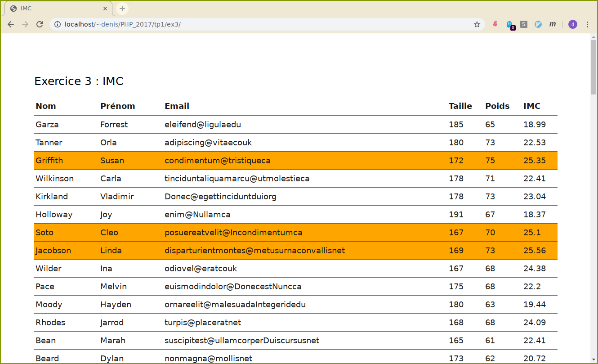

# Bases du langage PHP

Le repertoire `public_html` à la racine de votre compte est accessible  par http(s) à l'url suivante :

```
http[s]://dwarves.iut-fbleau.fr/~login/
```

Pour monter ce repertoire dans votre aborescence locale, vous pouvez utiliser le programme `sshfs` :
```
sshfs login@gatekeeper.iut-fbleau.fr:/export/home/an19/login repertoire/de/montage/local/
```


Vous pouvez récupérer sur le projet git

    https://dwarves.iut-fbleau.fr/git/monnerat/wim21.git

pour chaque exercice un squelette à compléter.

1.  Vous allez tester votre premier script php : `hello_world` :
    ```php
	<!DOCTYPE html>
	<html>
		<body>
		<?php echo "<h1>hello world</h1>";?>
		</body>
	</html>
	```

    - Placez le  fichier `hello_world.php` dans votre
    repertoire `public_html`, et testez.

    - En utilisant la fonction `phpinfo`, faites afficher dans le script
    précédent la configuration php du serveur dwarves.

2.  Quel est l'entier servant de clé à
	- chaque élément du tableau ?
        suivant :
	```php
	<?php
	$clients = array (
	"Luc", 
	7 => "Paul", 
	2 =>"Martin", 
	"Arnaud"
	);
	?>
	```

    -  à l'élément de valeur `Blouson` dans le tableau `$produits` ?
	```php
	<?php
	$produits = array (
	20 => "Chemise",
	3 => "Pantalon",
	10 => "Jupe",
	"Veste",
	"Blouson"
	);
	?>
	```

3.  Vous disposez du fichier [data.php](./ex3/include/data.inc.php) qui
    représente, sous forme d'un tableau, un certain nombre
    d'individus, avec pour chacun ses nom, prénom, email, taille et
    poids.

    Voici un extrait du fichier :
	```php
	$data = array(
	array("Nom"=>"Garza","Prenom"=>"Forrest","Email"=>"eleifend@ligulaedu","Taille"=>"185","Poids"=>"65"),
	array("Nom"=>"Tanner","Prenom"=>"Orla","Email"=>"adipiscing@vitaecouk","Taille"=>"180","Poids"=>"73"),
	array("Nom"=>"Griffith","Prenom"=>"Susan","Email"=>"condimentum@tristiqueca","Taille"=>"172","Poids"=>"75"),
	array("Nom"=>"Wilkinson","Prenom"=>"Carla","Email"=>"tinciduntaliquamarcu@utmolestieca","Taille"=>"178","Poids"=>"71"),
	array("Nom"=>"Kirkland","Prenom"=>"Vladimir","Email"=>"Donec@egettinciduntduiorg","Taille"=>"178","Poids"=>"73"),
	array("Nom"=>"Holloway","Prenom"=>"Joy","Email"=>"enim@Nullamca","Taille"=>"191","Poids"=>"67"),
	array("Nom"=>"Soto","Prenom"=>"Cleo","Email"=>"posuereatvelit@Incondimentumca","Taille"=>"167","Poids"=>"70")
	```

    1.  Ecrire un script qui affichent l\'ensemble des données sous
        forme d'un tableau html.
    2.  L'imc (indice de masse corporel) d\'une personne est donné par
        la formule `poids/taille^2` (poids en kilogramme et taille en mètre). 

		Ajouter une colonne avec la valeur de l'imc (2 chiffres après la virgule).

    3.  Une personne est considérée en surpoids lorsque son imc
        dépasse 25. Colorier les lignes du tableau en rouge lorsque la
        personne correspondante est en surpoids.

        

	    **Conseils**
		-   Pour utiliser le fichier de données, incluez-le dans votre
        script.
		-   La structure de langage `foreach` fournit une façon simple de
        parcourir des tableaux. `foreach` ne fonctionne que pour les
        tableaux et les objets, et émettra une erreur si vous tentez de
        l'utiliser sur une variable de type différent ou une variable
        non initialisée. Il existe deux syntaxes :

		 ```php
       foreach (array_expression as $value)
               commandes
       foreach (array_expression as $key => $value)
               commandes
		 ```
        
		 Des exemples
        [ici](http://fr2.php.net/manual/fr/control-structures.foreach.php).

		-   Pour arrondir un réel, vous pouvez utiliser la fonction [round](https://www.php.net/manual/fr/function.round.php).

4.  Ecrire un programme PHP qui affiche, sous forme d'une liste
    "cliquable" vos bookmarks (favoris) stockés dans un tableau
    associatif. Vos bookmarks seront classés par répertoire. Chaque
    répertoire aura donc un nom, et contiendra un certain nombre de
    favoris représentés par un nom, une image et une url.

    Exemple d'affichage :

    -   Moteurs de recherche :
        -   [![Google]](http://google.fr).
        -   [](http://yahoo.fr).
    -   Journaux :
        -   [](http://lemonde.fr).
        -   [](http://www.unixgarden.com/index.php/category/gnu-linux-magazine).
        -   [](http://lequipe.fr).
    -   Sports :
        -   [!](http://fff.fr).
        -   [!](www.ffdf.fr).

5.  Ecrire (et tester) une fonction 

    ```php
	
	<?php
	string createPassword(int $n, string $alphabet);
	?>
	```

	qui permet de générer un mot de passe de `n` caractères choisis
    aléatoirement parmi les caractères de `alphabet`.

	**Conseils**

    Il suffit de tirer aléatoirement `n` caractères de la chaîne
    `alphabet` et de les concatener.
	Les fonctions 
	[strlen](https://www.php.net/manual/fr/function.strlen.php) 
	et 
	[mt_rand](https://www.php.net/manual/fr/function.mt-rand.php)
	pourront vous être utiles.
