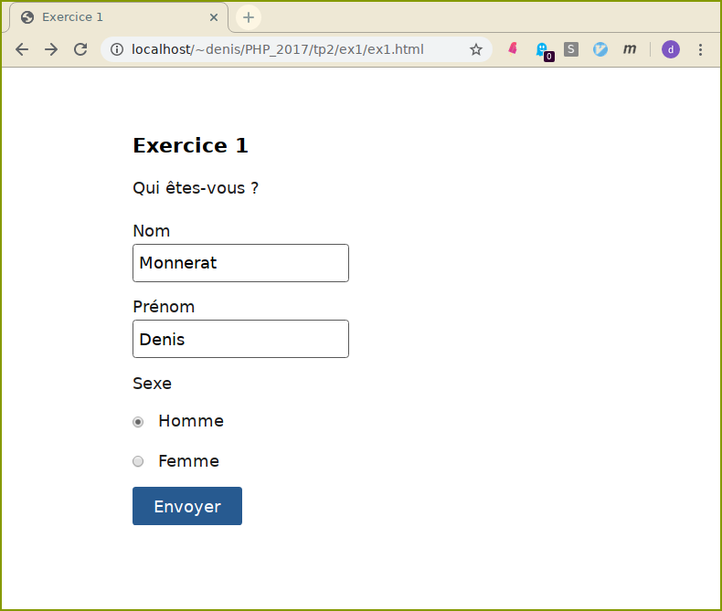
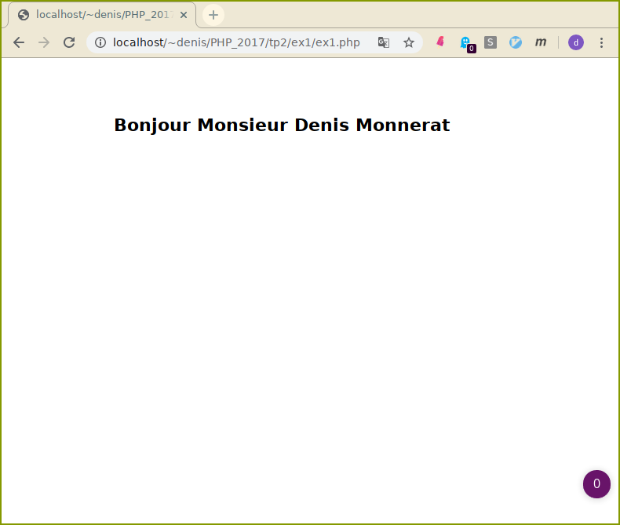
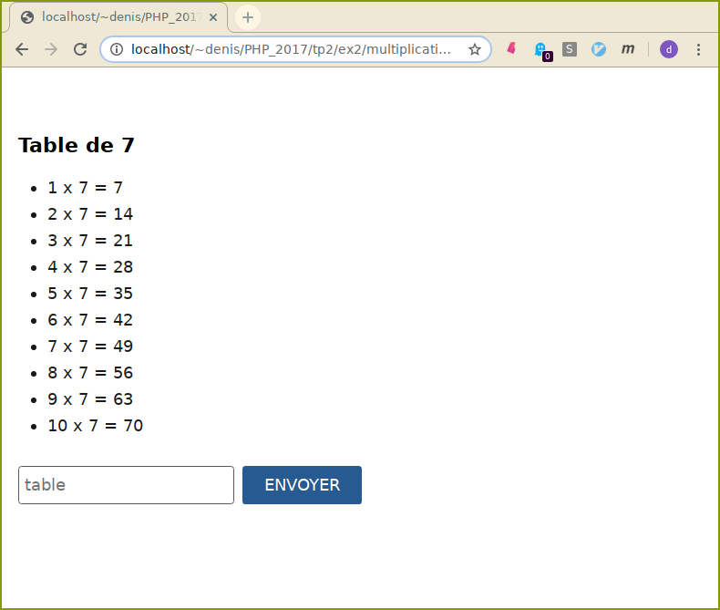
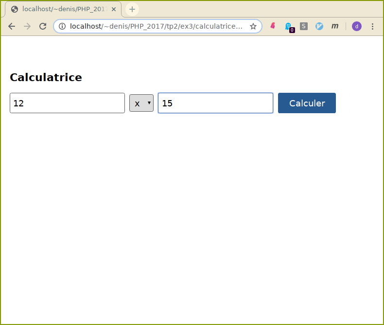
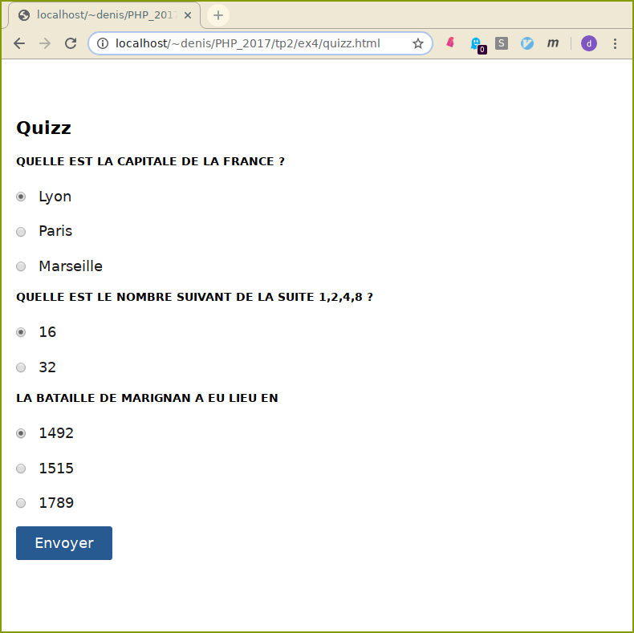
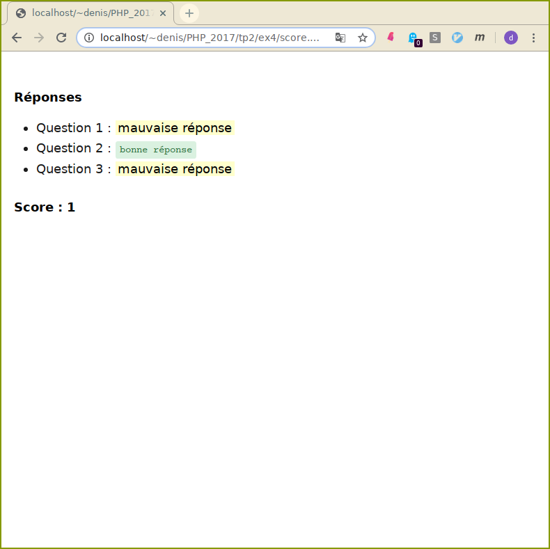
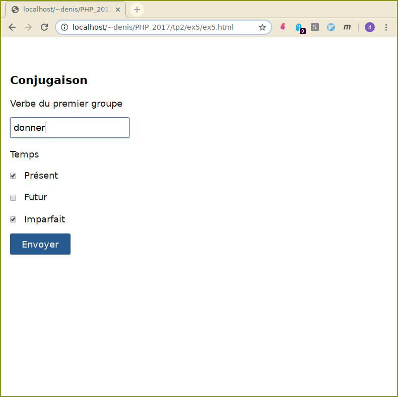
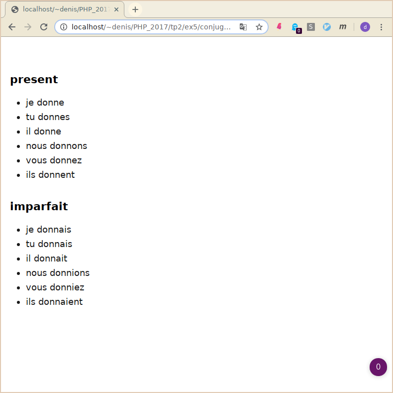

# TP 2 : Intéractions avec le client. Formulaires HTML et PHP.


> On utilisera autant que possible les fonctions
[filter\_input](http://php.net/manual/fr/function.filter-input.php) ou
[filter\_var](http://php.net/manual/fr/function.filter-var.php) qui
permettent de valider le type (ou nettoyer) des entrées d'un formulaire
(entre autre).

1.  Ecrire le script de traitement associé au formulaire (2 champs texte
    pour le nom et prénom, deux boutons radio pour choisir le sexe) qui
    affiche le message bonjour Monsieur ou bonjour Madame suivi du
    prénom et du nom.

     
     

    Faites en sorte que la première lettre (et elle seule) du prénom et
    du nom soit en en majuscule.

    Vous pouvez utilisez les fonctions :
    ```php
	string strtolower ( string $string );
	string ucfirst ( string $str );
	```

2.  Ecrire un (seul) script qui saisit dans un champs texte un entier et
    qui affiche la table de multiplication correspondante lors de la
    soumission.

    

3.  Ecrire une petite calculatrice permettant d'effectuer des
    opérations arithmétiques élémentaires (+,x,-,/) sur deux opérandes.

    
    1.  Première version : affichez un formulaire permettant, dans
        l'ordre, de saisir la première opérande, puis dans une liste
        (`SELECT`) l'opération, enfin de saisir la deuxième opérande.
        Associez à ce formulaire le script effectuant le calcul et
        affichant le résultat.

    2.  Assurez-vous qu'on ne puisse pas diviser par 0.
    3.  Deuxième version : après un calcul, réaffichez le formulaire en
        proposant comme valeur par défaut de la première opérande le
        résultat du calcul précédent.

4.  Vous diposez du fichier html `quizz.html`. Pour chaque question, il
    n'y a qu'une réponse exacte. On vous demande d'écrire le script
    php de traitement des réponses qui affiche au joueur le résultat du
    jeu :

    
    

    Regardez-bien comment est structuré le quizz (nom des variables,
    valeurs transmises, etc ). Cela doit vous permettre d'écrire un
    script php qui s'adaptera automatiquement si on rajoute ou on
    enlève des questions au quizz.

    Evidemment, il est très facile de tricher !

5.  Vous disposez du formulaire suivant :

    

    -   Un champ texte permet de saisir un verbe du premier groupe à
        conjuguer.
    -   Des cases à cocher permettent de choisir les temps de
        conjugaisons.

    Ecrire le script PHP qui receptionne les données **postées** par le
    formulaire précédent, et qui affiche le verbe conjugué aux temps
    choisis.
    

    **Quelques conseils**

    Pour extraire le radical, vous pouvez utiliser la 
	fonction [substr](http://fr2.php.net/manual/fr/function.substr.php)

	```php
	string substr ( string $string , int $start [, int $length ] );
	```

    Vous pouvez également stocker dans un tableau associatif les
    terminaisons possibles, ainsi que les pronoms personnels.

    ```php
	$terminaisons = array("present"=>array("e","es","e","ons","ez","ent"), ...
	```
