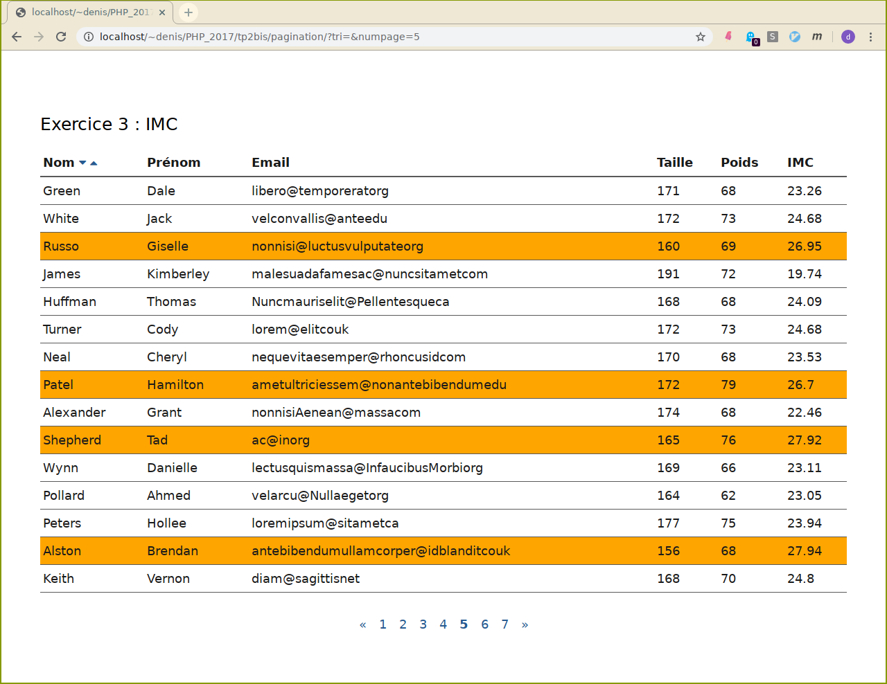

# TP 2b : Passage de paramètres à un script

1.  Le but est d'écrire un script php simulant le jeu de hasard pierre,
    feuille ciseaux (encore appelé chifoumi).

    
	
	<details><summary>Conseils</summary>
	<div>
    Le joueur joue en cliquant sur l'icone représentant le coup qu'il
    a choisi. Celui-ci est un lien vers le même script, auquel est passé
    en GET un paramètre représentant son coup. Par exemple :

	```html
	<a href="?coup=0"></a>
	<a href="?coup=1"></a>
	<a href="?coup=2"></a>
	```
    Le script récupère le coup du joueur, fait un tirage aléatoire, et
    affiche les deux coups joués avec un message pour indiquer le
    résultat de la partie.

2.  On reprend l'exercice 2 [tp1](../tp1) afin de paginer
    l'affichage du tableau. 

    

    L'affichage ne fait apparaître qu'une tranche du tableau, et une
    barre de navigation permet d'accèder aux différentes pages.

    Après avoir choisi le nombre de personnes par page, rajouter à la
    suite du tableau des liens de navigations :

    -   2 flèches de navigations (précédent et suivant).
    -   un accès direct à chaque page par son numéro.

    Le lien de la page sur laquelle on se trouve doit être signalé.
	<details><summary>Conseils</summary>
	<div>
    Le nombre de pages se calcule facilement par une division. Utilisez
    la fonction `ceil` pour arrondir un nombre réel à l'entier
    supérieur.

    Le numéro de la page d'affichage sera passé au script dans les urls
    des liens de la barre de navigation.

    Gérer tous les cas où le numéro de page n'est pas valide.
	</div>
	</details>

3.  Dans l'exercice précédent, rajoutez la possibilié de trier
    l'ensemble du tableau suivant le nom. Il y a 2 petits triangles
    (croissant/décroissant) dans l'entête de la première colonne.

	<details>
	<summary>Conseils</summary>
	<div>
    - Pour le tri du tableau, utiliser la fonction <code>usort</code>
        Le deuxième paramètre est une chaîne correspondant à
        l'identifiant de la fonction d'ordre pour votre tri. Consultez
        les exemples 
        <a href="http://php.net/manual/fr/function.usort.php">page</a> de la
        fonction.
    - Il faut évidemment rajouter un paramètre à votre script.
	</div>
	</details>
