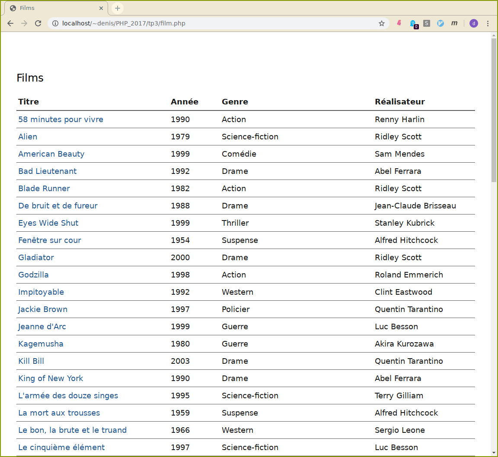
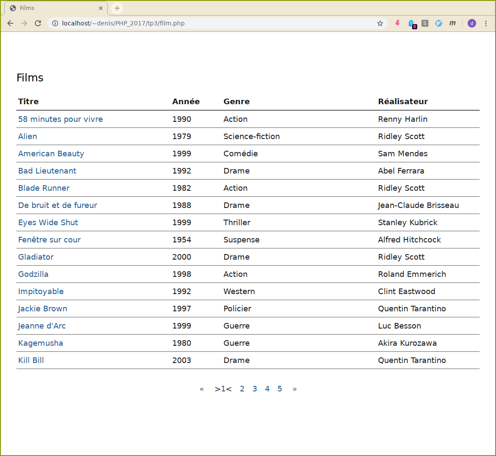
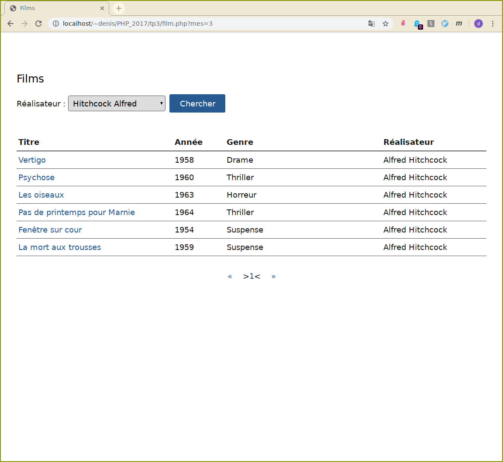
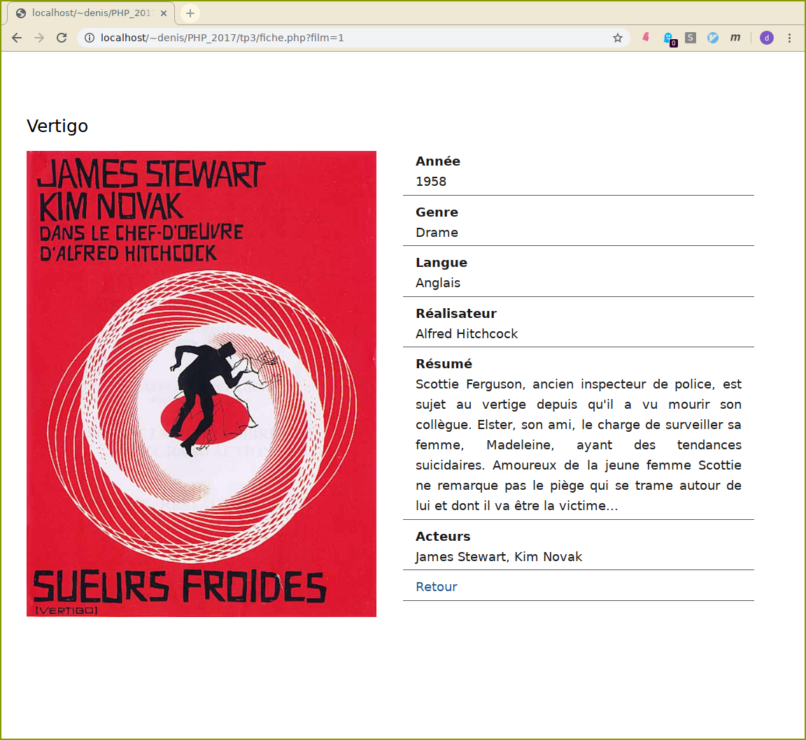

# TP3 : PHP/MariaDB avec l'extension **mysqli**.

**Avant de commencer**

-   Vous diposez, sur le serveur mysql qui tourne sur la machine
    dwarves.arda, d'un compte identifié par votre login. Le mot de
    passe a été initailisé avec votre login. Pensez à le changer
    rapidement.
-   Vous disposez en lecture/écriture d'une seule base de données
    identifiée là encore par votre login.
-   Vous avez aussi accès à cette
    [url](https://dwarves.iut-fbleau.fr/phpmyadmin/) à une interface web
    (phpmyadmin) de gestion de votre base.

Pour travailler, importez dans votre base les tables et leurs contenus

```sql
Artiste (idArtiste,nom,prenom,anneeNaiss)
	     ---------
Genre (code)
       ----
Pays (code,nom,langue)
	  ----
Film (idFilm,titre,annee,#idMes,#genre,resume,#codePays,urlImage)
	  ------
Role (#idFilm,#idActeur,nomRole)
	  ------- --------  -------
```

qui se trouvent dans le fichier **cinema.sql**. Vous pouvez directement
l'importer à partir de phpmyadmin. Examinez les tables, leurs
structures et relations.

  Par pitié !

**Testez directement vos requêtes sql avec phpmyadmin (ou autre) avant
des les \"intégrer\" à php !**


1. Complétez le script **films.php** qui affiche la liste de tous les films
   de votre base sous forme d'une table html, classée par titre, avec
   l'année, le genre et le réalisateur.

    

    <details><summary>Conseils</summary>
    <div>

   - le serveur tourne sur le serveur http, donc pour vous connecter,
      utiliser `localhost` comme nom. 
   - Pour récuperer les informations demandées, pensez à faire une
      jointure entre Film et Artiste.
    </div>
    </details>   

2. Modifiez le script précédent afin de paginer l'affichage des films.

    

    <details><summary>Conseils</summary>
    <div>

   - La clause `LIMIT` dans un SELECT permet de restreindre le nombre de
    résultats de la requête.

   - L'option `SQL_CALC_FOUND_ROWS` permet, en présence de la clause
    LIMIT, de savoir combien de resultats auraient été selectionnée en
    son absence.  

    Il faut utliser juste après la requête la fonction MySQL
    `FOUND_ROWS()`.
	 </div>
	 </details>

3. Ajoutez dans le script précédent un formulaire avec une liste déroulante
   qui permet de filtrer les films par réalisateur.

    

    <details>summary>Conseils</summary>
    <div>

   Il faut récupérer dans la table Artiste les réalisateurs, et peupler une
   liste déroulante. La valeur envoyé par le formulaire sera bien sûr
   l'identifiant du réalisateur.

   Faites en sorte, comme sur la capture d'écran, de réafficher la liste
   déroulante avec le nom du réalisateur dernièrement selectionné.
    </div>
    </details>

4. On veut dans cette question, à partir de la liste, afficher le détail
   d'un film. Pour cela, chaque titre, dans le tableau, sera un lien qui
   conduira à la fiche du film. L'identifiant du film sera passé dans
   l'url du lien. 
   
   ```php
   <a href="./fiche.php?film=1">Vertigo</a>
   ```

    

5. Pour ceux qui s'ennuient, faites en sorte que l'on puisse trier
   l'affichage sous forme de tableau par odre de titre, année, ou genre.
