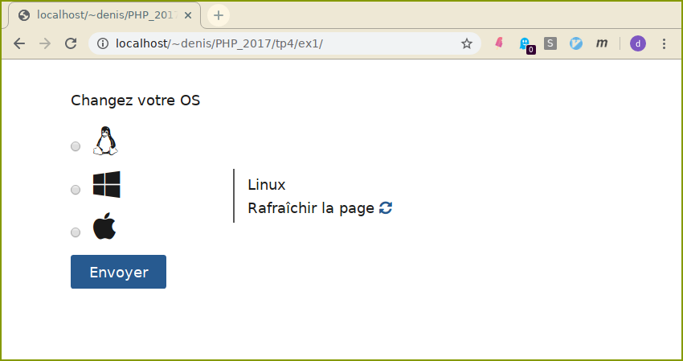
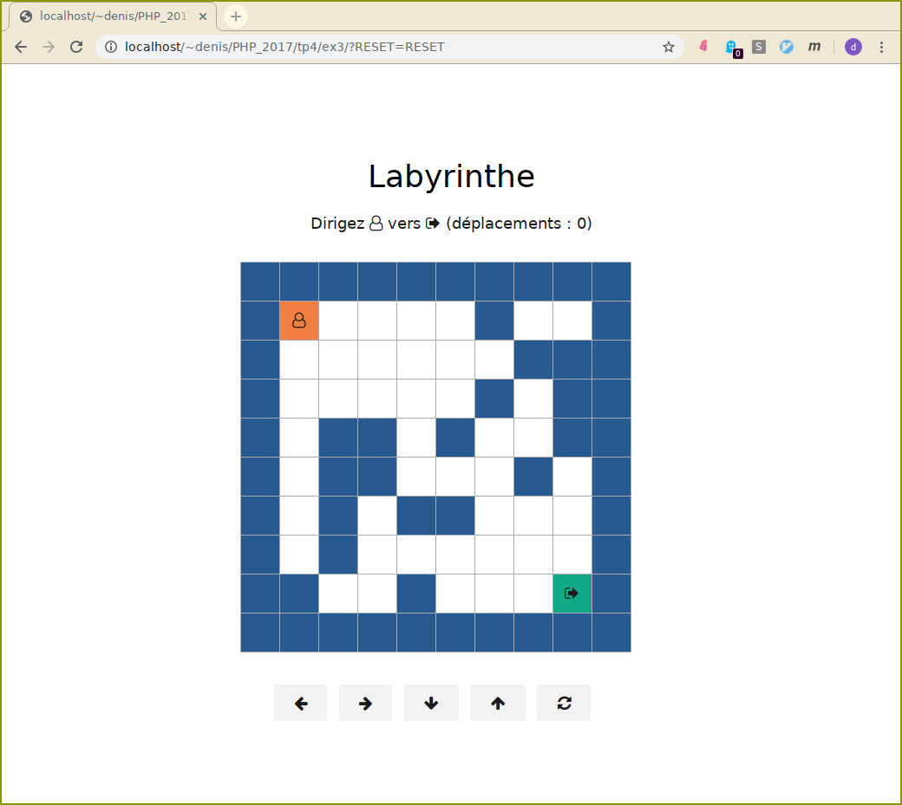

#  Cookies et sessions en PHP.


1.  Complétez le script `index.php` de l'exercice 1 de manière à
    mémoriser grâce à un cookie son os préféré (parmi Linux, Windows et
    MacOS). Le cookie est valable pendant une minute, et l'os par
    défaut est Linux.

    


2.  On désire rendre les pages du [tp3](./tp3) (cinema) accessibles
    uniquement à des utilisateur **inscrits au préalable**.

    -  Rajouter à la base une table `user` qui comprend un **login**,
        **email** et un **password**. (login est la clé)
    -  Ecrire un formulaire d'inscription au site qui comprend les
        champs correspondants. Vous enregistrerez dans la base la mot de
        passe hashé avec la fonction
        [password\_hash](http://php.net/manual/fr/function.password-hash.php)
        de php.
    -  Faire en sorte que toutes les pages de l'application soient
        accessibles **uniquement** si l'utilisateur s'est authentifié.
        (utiliser une session)

    Ecrire les scripts ou pages suivants
    <dl>
	<dt><code>inscription.php</code></dt>
    <dd>formulaire d'inscription, et qui traite les données du formulaire.
    Si le formulaire n'est pas correctement rempli, Il est réaffiché.
    (les champs correctes sont conservés !)</dd>
    <dt><code>authentification.html</code></dt>
    <dd>formulaire d'authentification.</dd>
    <dt><code>verification.php</code></dt>
    <dd>traite le formulaire précédent et vérifie si l'utilisateur est
    enregistré. En cas de succés, renvoie vers la page d'accueil du
    site. Pour éviter des attaques force brute, ajoutez une
    temporisation qui ralentira de telles attaques.</dd>
    <dt><code>securite.php</code></dt>
    <dd>morceau de code que vous inclurez systématiquement dans vos pages
    que vous voulez rendre accessible uniquement aux utilisateurs dûment
    authentifiés. Ce script vérifiera l'existence d'une variable de
    session créée lors de la connexion.</dd>
    </dl>
    Pour permettre l'authentification d'un utilisateur, il faut que
    login et le mot de passe conviennent. On compare le hash de
    l'utilisateur stocké dans la base avec le hashage calculé du
    password soumis lors de l'authentification :  

	```php
	<?php
	// Voir l'exemple fourni sur la page de la fonction password_hash()
	// pour savoir d'où cela provient.
	$hash = '$2y$07$BCryptRequires22Chrcte/VlQH0piJtjXl.0t1XkA8pw9dMXTpOq';

	if (password_verify('rasmuslerdorf', $hash)) {
		echo 'Le mot de passe est valide !';
	} else {
		echo 'Le mot de passe est invalide.';
	}
	?>
	```

3.  Le but est de créer un mini-jeu où l'on doit amener le joueur vers
    un but à travers un labyrinthe.

    

    - Dans le fichier `include/labyrinthe.php`, complétez la fonction
      php qui calcule un labyrinthe : un tableau de caractères à 2
      dimensions (sans les obtacles pour l'instant).  
      On représente un morceau de mur par `#`, le personnage par `o`, et la sortie par `*`.

      ```php
	  <?php
	  function creer_labyrinthe($l,$h,$dx,$dy,$ax,$ay){
	  // $l,$h taille
	  // $dx,$dy départ
	  // $ax,$ay arrivée
	  }
	  ?>
	  ```
    - Ecrire la fonction php qui affiche un labyrinthe en html,

     ```php
	 <?php
	 function afficher_labyrinthe($m){
	 // affiche le labyrinthe
	 // sous la forme d'une table html
	 }
	 ?>
	 ```

     sous forme d'une table html, comme sur la capture d'écran.
     Pour cela, vous disposez, dans `css/style.css`, des classes css `labyrinthe, sortie, thesee, mur`.

    - Ajoutez le code correspondant aux actions possibles
        (déplacements, réinitialisation de la partie) du formulaire.

      Pour cela, on utilisera les variables de session suivantes :

      - `$_SESSION['m']` : la matrice du jeu.
      - `$_SESSION['x]` et `$_SESSION['y']` : le position actuelle
            du joueur.
      - `$_SESSION['mv']` : le nombre de déplacements du joueur
           depuis le début de la partie.

    - Ajoutez des obtacles dans le labyrinthe (on ne s'intéressera
        pas au problème de l'existence d'un chemin pour sortir).

